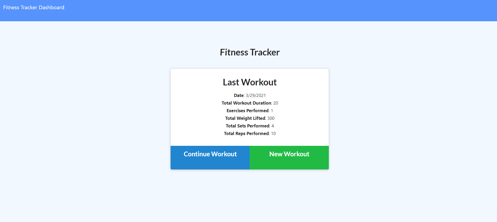

# Fitness Tracker

## Description:
This application is designed for a user to be able to track a fitness plan. When you open up the application the user is given the option to add a new workout or continue a previous workout. WHen the form is filled out for either option, the user will be redirected to a page where you can see all information about previous workouts in a graph! The graph on the left track total duraiton, where the graph on the right tracks pounds lifted. 

## Technology Used:
This application was designed using HTML, CSS, JavaScript, Express, MongoDb, Node

## Future Innovations:
Would love to be able to add more functionality on that stats page. Adding a calander to specify which workouts were done on each day. It would be great to look back and track progress over a long period of time. 

## Project Example:

## Contact Me:
Github: https://github.com/JakeMelville

Email: jakemelville@ymail.com
